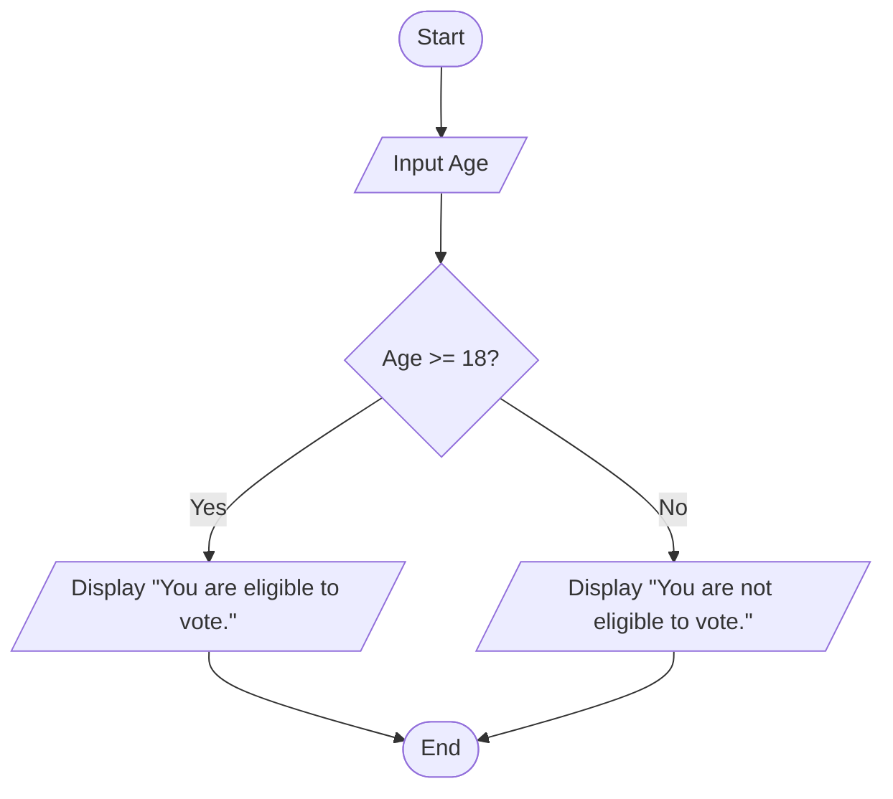
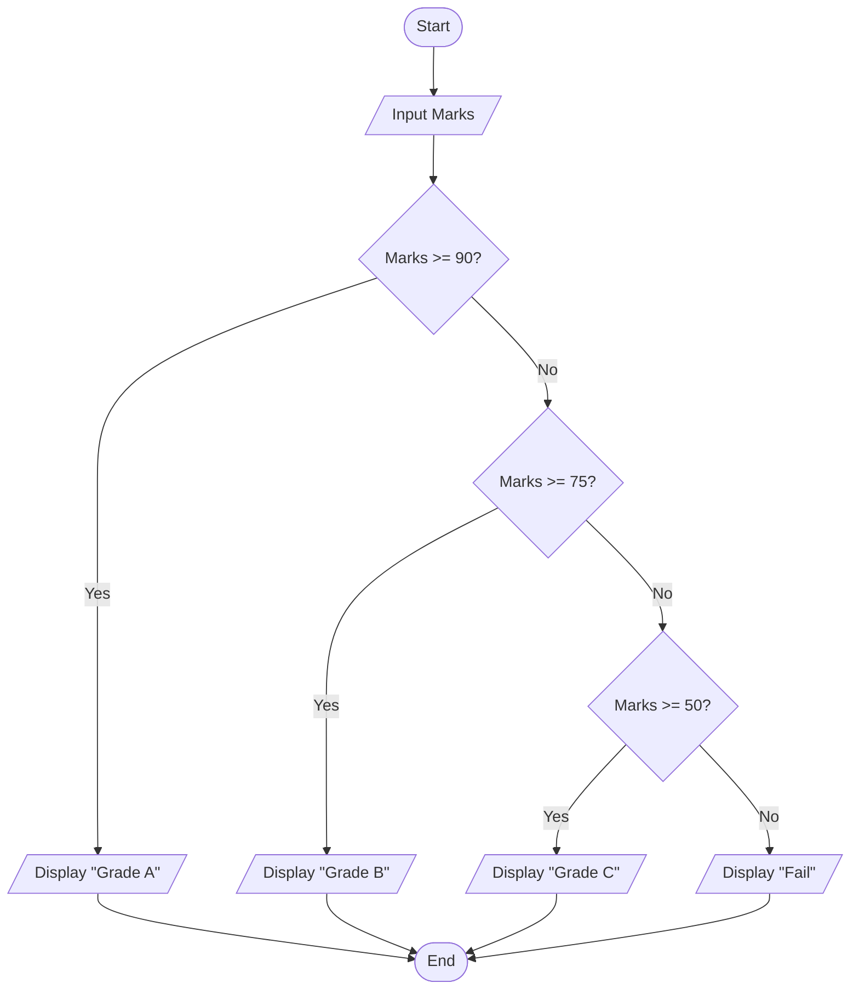
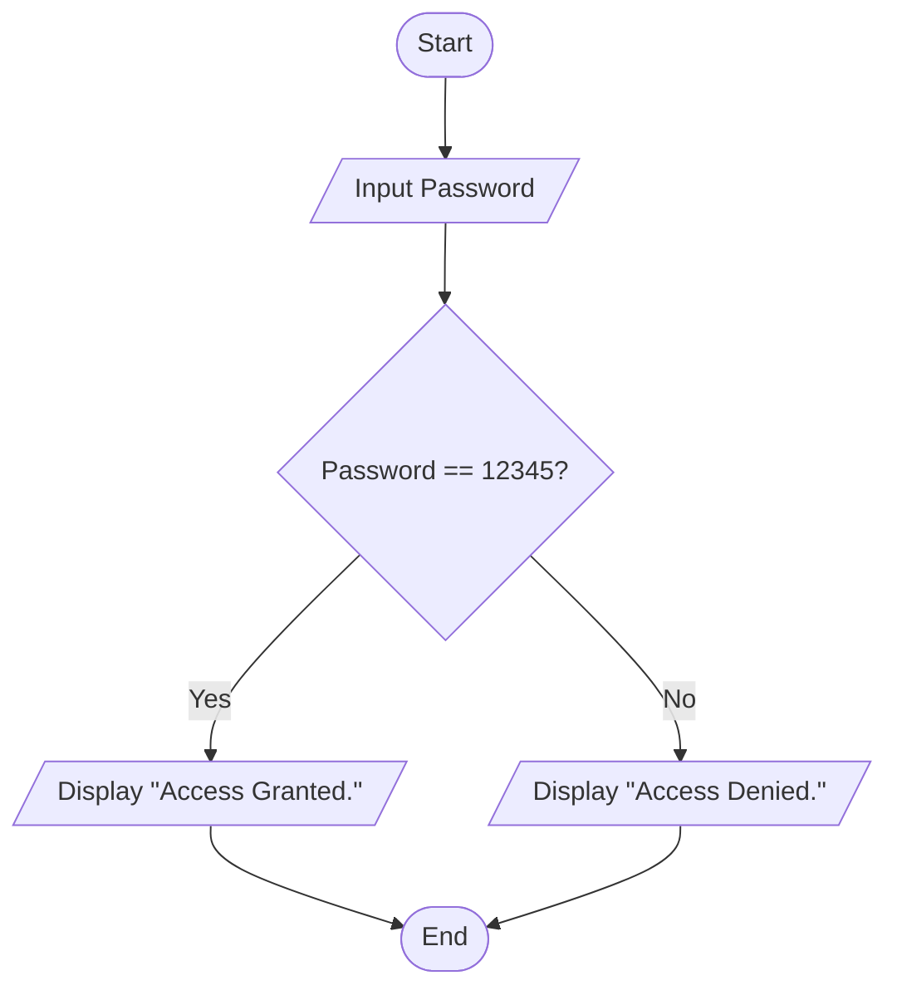
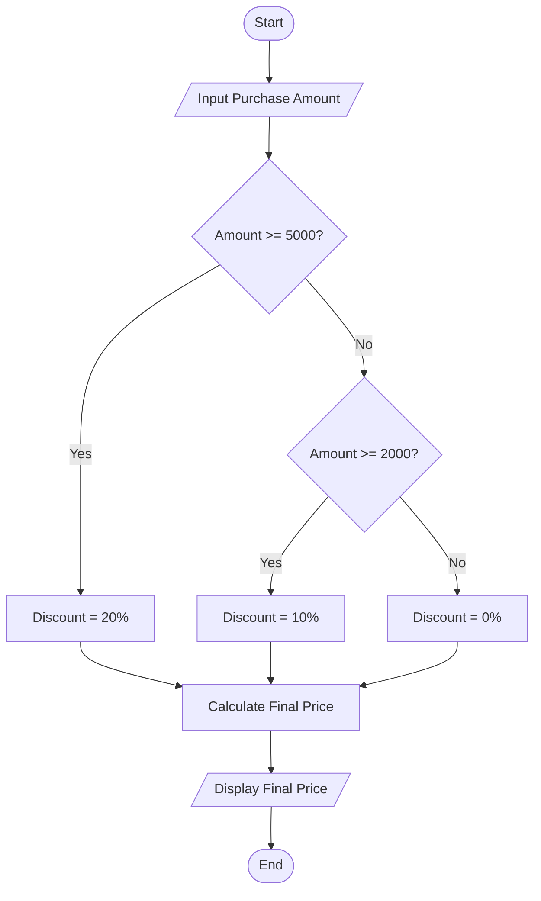
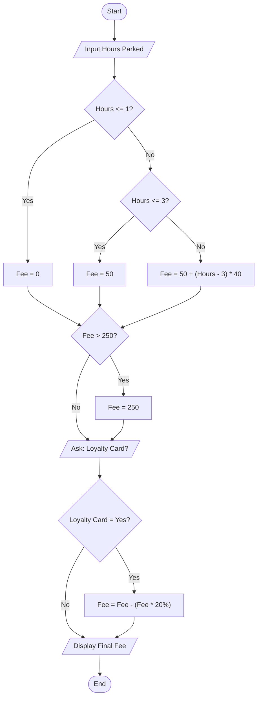

# Algorithm & Flowchart Exercises

This document contains the exercises from the **Algorithm & Flowchart** lesson, with:
- the original exercise task,
- a clear solution in pseudocode,
- a Java program for each exercise,
- and Mermaid flowcharts for the flowchart exercises.

---

# Part 1: Pseudocode Exercises

## Exercise 1: Find the Largest of Two Numbers

### Exercise

Write a program that:

1. Takes two numbers, **A** and **B**, as input.
2. Compares the two numbers.
3. Displays which number is larger.
4. If they are equal, display **"Both numbers are equal."**

### Pseudocode Solution

```text
Start
    Input A
    Input B

    If A > B Then
        Display A, "is larger"
    Else If B > A Then
        Display B, "is larger"
    Else
        Display "Both numbers are equal."
    EndIf
End
```

---

## Exercise 2: Sum of 5 Numbers

### Exercise

Write a program that:

1. Reads **5 numbers** one by one.
2. Calculates their **total sum**.
3. Displays the final result.

### Pseudocode Solution

```text
Start
    Set Sum = 0

    For Count = 1 To 5
        Input Number
        Sum = Sum + Number
    EndFor

    Display Sum
End
```

---

# Part 2: Flowchart Exercises

## Exercise 3: Voting Eligibility

### Exercise

Write a program that asks the user to enter their age.

- If the age is **18 or older**, display: `"You are eligible to vote."`
- If the age is **less than 18**, display: `"You are not eligible to vote."`
- End the program.

### Flowchart Solution



### Pseudocode Solution

```text
Start
    Input Age

    If Age >= 18 Then
        Display "You are eligible to vote."
    Else
        Display "You are not eligible to vote."
    EndIf
End
```

---

## Exercise 4: Student Grade Calculator

### Exercise

Write a program that takes a student's marks out of 100 and determines the grade:

- **90 or above:** `"Grade A"`
- **75 to 89:** `"Grade B"`
- **50 to 74:** `"Grade C"`
- **Below 50:** `"Fail"`
- End the program.

### Flowchart Solution



### Pseudocode Solution

```text
Start
    Input Marks

    If Marks >= 90 Then
        Display "Grade A"
    Else If Marks >= 75 Then
        Display "Grade B"
    Else If Marks >= 50 Then
        Display "Grade C"
    Else
        Display "Fail"
    EndIf
End
```

---

## Exercise 5: Simple Password Check

### Exercise

Write a program that:

1. Asks the user to enter a password.
2. Compares it with a stored password, for example `"12345"`.
3. If they match, display: `"Access Granted."`
4. If they do not match, display: `"Access Denied."`
5. End the program.

### Flowchart Solution



### Pseudocode Solution

```text
Start
    Set StoredPassword = "12345"

    Input Password

    If Password == StoredPassword Then
        Display "Access Granted."
    Else
        Display "Access Denied."
    EndIf
End
```

---

## Exercise 6: Online Shopping Discount

### Exercise

Write a program that calculates the final price of an online order:

1. Input the **total purchase amount**.
2. If the amount is **5000 kr or more**, apply a **20% discount**.
3. If the amount is between **2000 kr and 4999 kr**, apply a **10% discount**.
4. If the amount is less than **2000 kr**, no discount is applied.
5. Calculate and display the **final price** after the discount.
6. End the program.

### Flowchart Solution



### Pseudocode Solution

```text
Start
    Input Amount

    If Amount >= 5000 Then
        Discount = 0.20
    Else If Amount >= 2000 Then
        Discount = 0.10
    Else
        Discount = 0
    EndIf

    FinalPrice = Amount - (Amount * Discount)

    Display FinalPrice
End
```

---

## Exercise 7: Smart Parking Fee Calculator

### Exercise

Write a program that calculates the parking fee for a city garage:

1. Ask the user for the **number of hours** parked.
2. If the time is **1 hour or less**, the fee is **0 kr**.
3. If the time is **between 1 and 3 hours**, the fee is a flat **50 kr**.
4. If the time is **more than 3 hours**, calculate the fee as:

```text
50 kr + (40 kr for every hour beyond the 3rd hour)
```

5. If the calculated fee is **greater than 250 kr**, set the fee to **250 kr**.
6. Ask if the user has a **Loyalty Card**.
7. If the answer is **Yes**, subtract **20%** from the fee.
8. Display the **Final Fee** and end the program.

### Flowchart Solution



### Pseudocode Solution

```text
Start
    Input Hours

    If Hours <= 1 Then
        Fee = 0
    Else If Hours <= 3 Then
        Fee = 50
    Else
        Fee = 50 + ((Hours - 3) * 40)
    EndIf

    If Fee > 250 Then
        Fee = 250
    EndIf

    Input LoyaltyCard

    If LoyaltyCard == "Yes" Then
        Fee = Fee - (Fee * 0.20)
    EndIf

    Display Fee
End
```

---