# Workshop: Algorithm and Flowchart

For each question in this workshop, you must complete **two** things:

1. **Write the pseudocode**
2. **Draw the flowchart** using either
   - **Option 1:** Draw.io (recommended)
   - **Option 2 (optional):** Mermaid flowchart directly in Markdown
   - **Option 3 (optional):** Any other valid method

---

## 1. Check Even or Odd Number

Design an algorithm and flowchart that take a number as input and determine whether it is even or odd.

### ✔ Pseudocode

```text
START
    INPUT number

    IF number % 2 == 0 THEN
        PRINT "Even"
    ELSE
        PRINT "Odd"
    ENDIF
END
```

### ✔ Flowchart

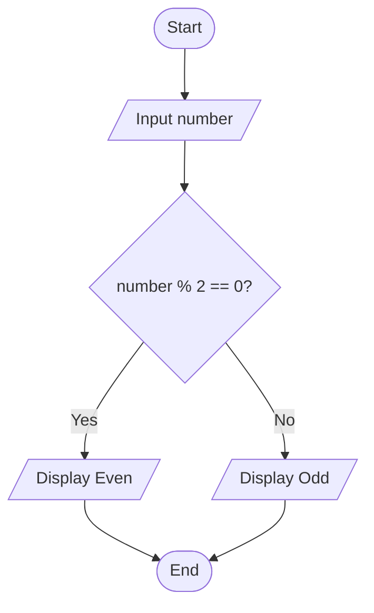

---

## 2. Calculate Total and Average Marks

Write the algorithm and draw the flowchart for a program that inputs marks for 3 subjects, calculates the total and average, and displays both.

### <span style="color: #22c55e;">✔</span> Pseudocode

```text
START
    INPUT mark1
    INPUT mark2
    INPUT mark3

    total = mark1 + mark2 + mark3
    average = total / 3

    PRINT total
    PRINT average
END
```

### <span style="color: #22c55e;">✔</span> Flowchart

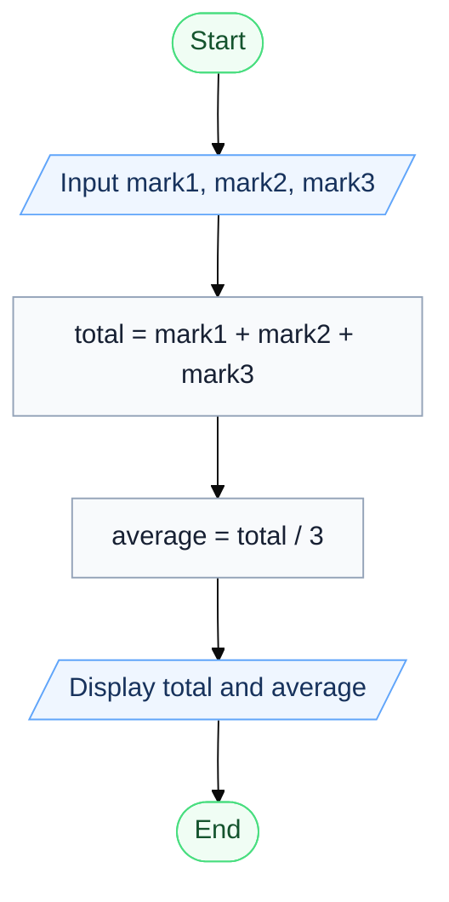

---

## 3. Display Multiplication Table

Create an algorithm and flowchart that input a number and display its multiplication table from 1 to 10 using a loop.

### <span style="color: #22c55e;">✔</span> Pseudocode

```text
START
    INPUT number

    FOR i = 1 TO 10
        result = number * i
        PRINT number × i = result
    ENDFOR
END
```

### <span style="color: #22c55e;">✔</span> Flowchart

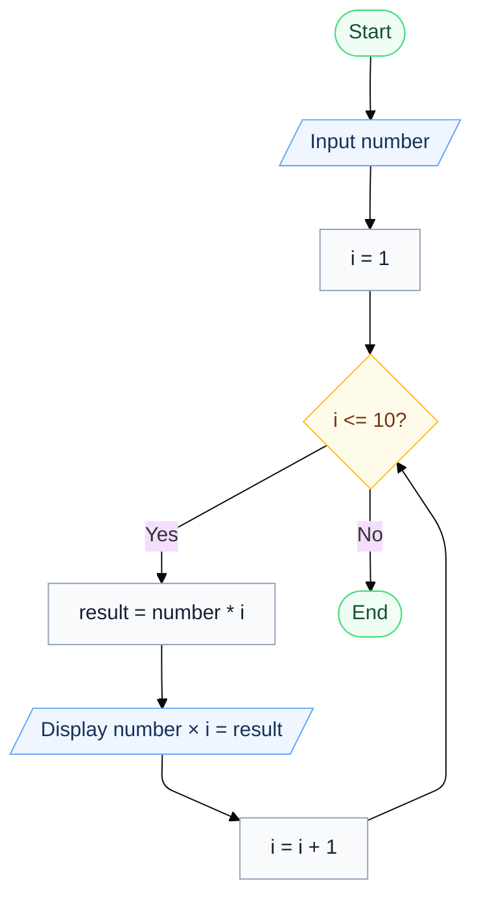

---

## 4. Positive, Negative, or Zero Check

Write the algorithm and flowchart to input a number and display whether it is positive, negative, or zero.

### <span style="color: #22c55e;">✔</span> Pseudocode

```text
START
    INPUT number

    IF number > 0 THEN
        PRINT "Positive"
    ELSE IF number < 0 THEN
        PRINT "Negative"
    ELSE
        PRINT "Zero"
    ENDIF
END
```

### <span style="color: #22c55e;">✔</span> Flowchart

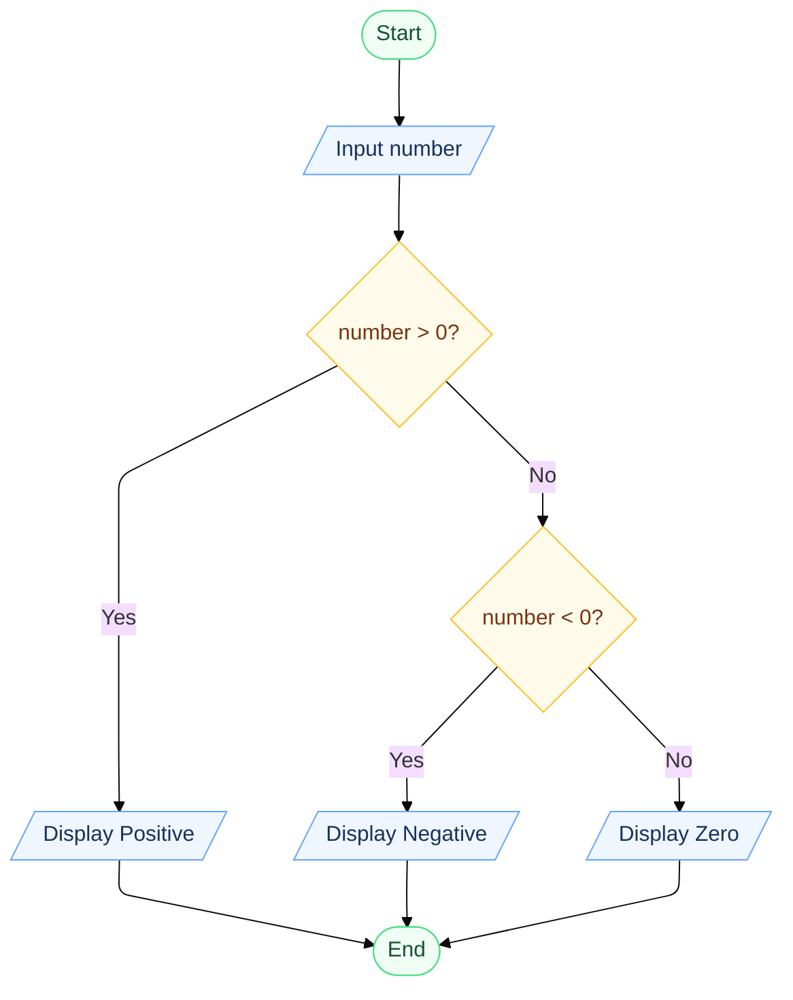

---

## 5. Simple Interest Calculator

Create an algorithm and flowchart for a program that calculates simple interest using the formula:

**SI = (P × R × T) / 100**

### <span style="color: #22c55e;">✔</span> Pseudocode

```text
START
    INPUT P
    INPUT R
    INPUT T

    SI = (P * R * T) / 100

    PRINT SI
END
```

### <span style="color: #22c55e;">✔</span> Flowchart

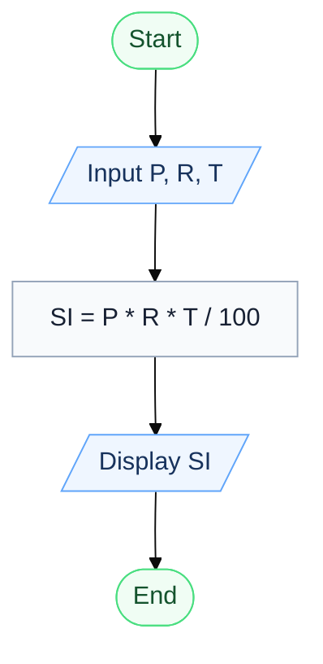

---

## 6. Average Temperature Calculation

Write the algorithm and draw the flowchart for a program that takes the temperature of 7 days, finds the average temperature, and displays it.

### <span style="color: #22c55e;">✔</span> Pseudocode

```text
START
    total = 0

    FOR day = 1 TO 7
        INPUT temperature
        total = total + temperature
    ENDFOR

    average = total / 7
    PRINT average
END
```

### <span style="color: #22c55e;">✔</span> Flowchart

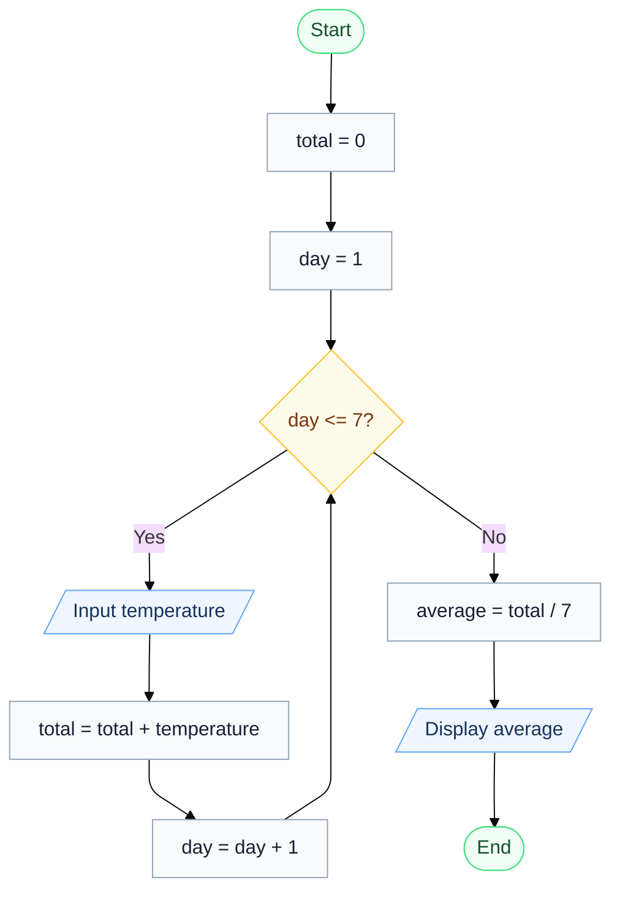

---

## 7. Calculate Area of a Rectangle

Create an algorithm and flowchart to input length and width, calculate the area (**Area = Length × Width**), and display the result.

### <span style="color: #22c55e;">✔</span> Pseudocode

```text
START
    INPUT length
    INPUT width

    area = length * width

    PRINT area
END
```

### <span style="color: #22c55e;">✔</span> Flowchart

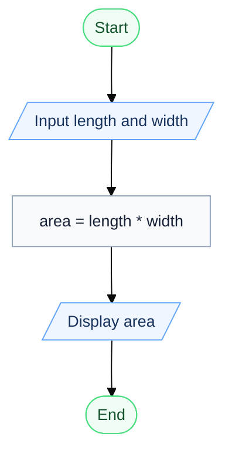

---

## 8. Determine Pass or Fail

Write the algorithm and draw the flowchart for a program that takes a student's average marks and displays **"Pass"** if average ≥ 50, otherwise **"Fail"**.

### <span style="color: #22c55e;">✔</span> Pseudocode

```text
START
    INPUT average

    IF average >= 50 THEN
        PRINT "Pass"
    ELSE
        PRINT "Fail"
    ENDIF
END
```

### <span style="color: #22c55e;">✔</span> Flowchart

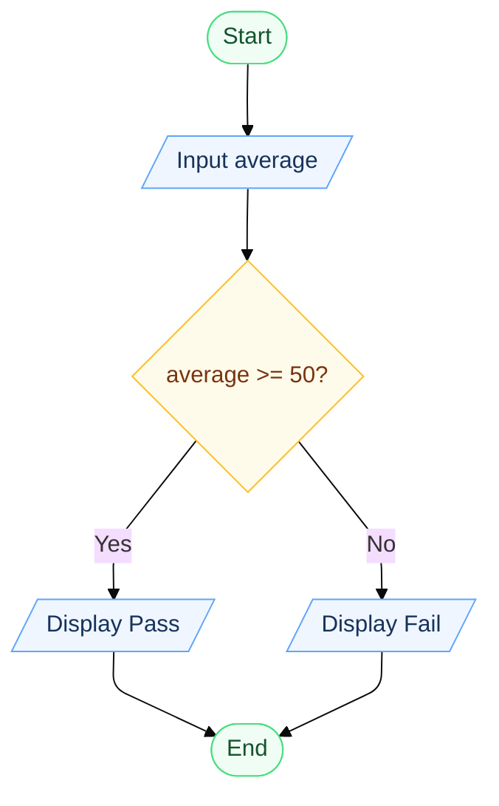

---

## 9. Calculate Factorial of a Number

Write the algorithm and draw the flowchart that input a number and calculate its factorial using a loop.

### <span style="color: #22c55e;">✔</span> Pseudocode

```text
START
    INPUT number
    factorial = 1

    FOR i = 1 TO number
        factorial = factorial * i
    ENDFOR

    PRINT factorial
END
```

### <span style="color: #22c55e;">✔</span> Flowchart

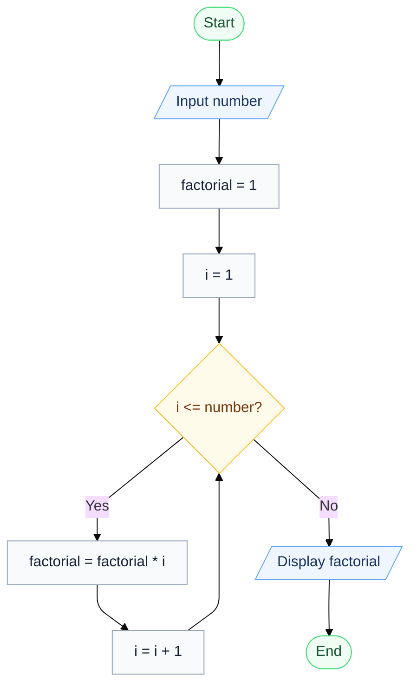

---

## 10. Calculate Discount on Purchase

Write the algorithm and draw the flowchart for a program that inputs the purchase amount and gives a **10% discount** if the amount is greater than 1000.

### <span style="color: #22c55e;">✔</span> Pseudocode

```text
START
    INPUT amount

    IF amount > 1000 THEN
        discount = amount * 0.10
    ELSE
        discount = 0
    ENDIF

    finalAmount = amount - discount

    PRINT discount
    PRINT finalAmount
END
```

### <span style="color: #22c55e;">✔</span> Flowchart

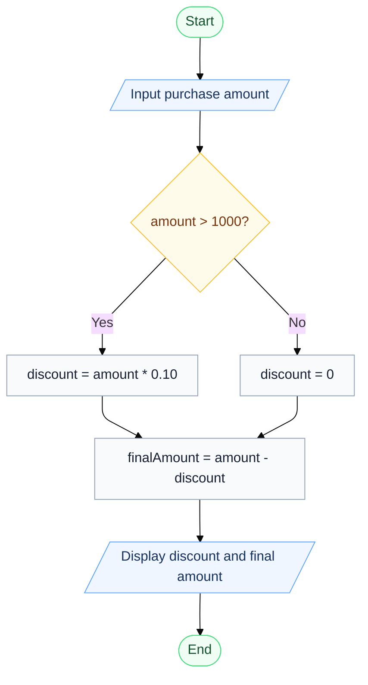

---

# Optional Exercises

## 11. Online Shopping Delivery Eligibility

Write the algorithm and draw the flowchart for a program that inputs a customer's purchase amount and displays **"Free Delivery"** if the amount is 500 SEK or more; otherwise display **"Delivery Charge Applies"**.

### <span style="color: #22c55e;">✔</span> Pseudocode

```text
START
    INPUT amount

    IF amount >= 500 THEN
        PRINT "Free Delivery"
    ELSE
        PRINT "Delivery Charge Applies"
    ENDIF
END
```

### <span style="color: #22c55e;">✔</span> Flowchart

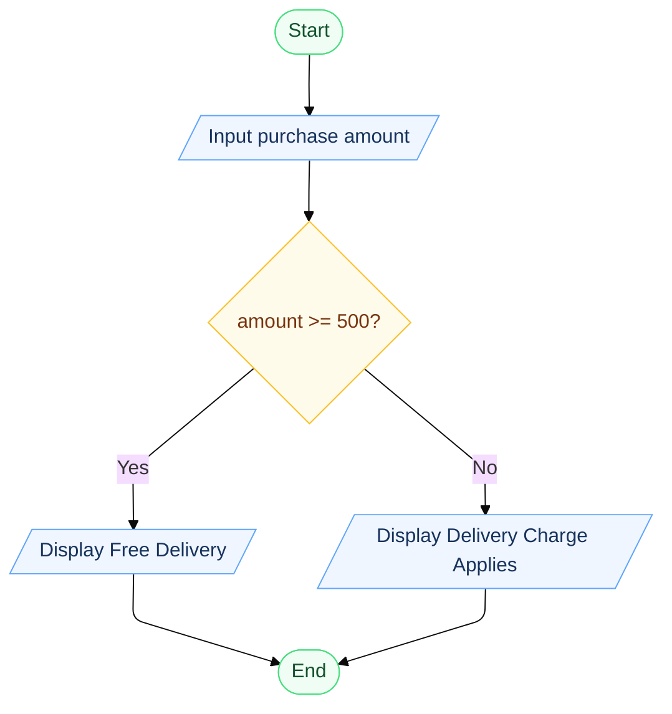

---

## 12. Employee Salary and Bonus Calculator

Write the algorithm and draw the flowchart for a program that inputs an employee's monthly salary and years of service, calculates a bonus of **10%** for employees with 5 or more years of service and **5%** for others, then displays the bonus and total salary.

### <span style="color: #22c55e;">✔</span> Pseudocode

```text
START
    INPUT salary
    INPUT yearsOfService

    IF yearsOfService >= 5 THEN
        bonus = salary * 0.10
    ELSE
        bonus = salary * 0.05
    ENDIF

    totalSalary = salary + bonus

    PRINT bonus
    PRINT totalSalary
END
```

### <span style="color: #22c55e;">✔</span> Flowchart

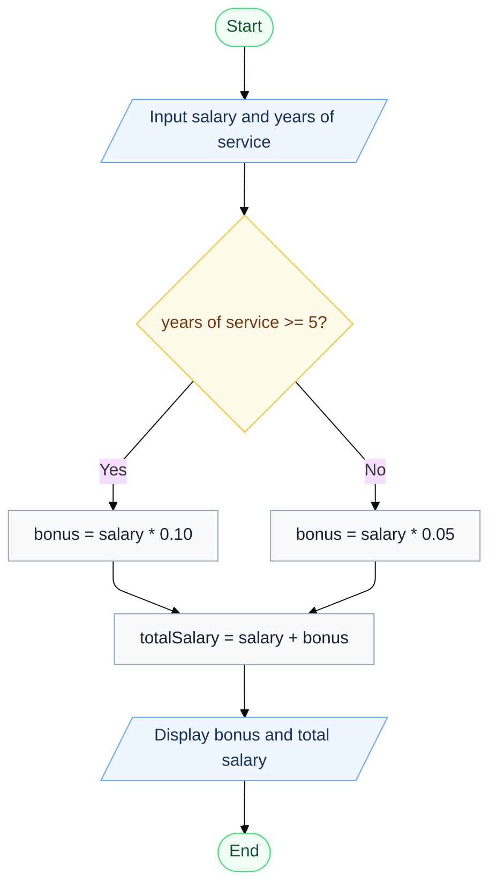

---

## 13. Mobile Data Usage Monitor

Write the algorithm and draw the flowchart for a program that inputs a user's monthly data limit and data usage, then displays whether the user has exceeded the limit or how much data remains.

### <span style="color: #22c55e;">✔</span> Pseudocode

```text
START
    INPUT dataLimit
    INPUT dataUsage

    IF dataUsage > dataLimit THEN
        exceeded = dataUsage - dataLimit
        PRINT "Limit exceeded by", exceeded
    ELSE
        remaining = dataLimit - dataUsage
        PRINT "Data remaining", remaining
    ENDIF
END
```

### <span style="color: #22c55e;">✔</span> Flowchart

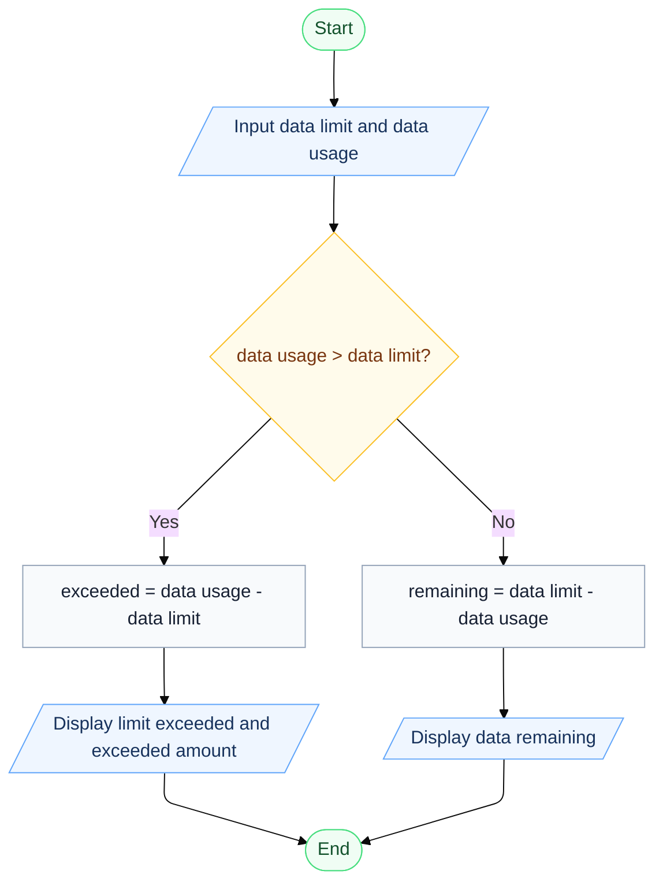

---

## 14. Login System (Maximum 3 Attempts)

Create an algorithm and flowchart for a login system that allows a user up to 3 attempts to enter the correct password. Display **"Access Granted"** if the password is correct; otherwise display **"Account Locked"** after 3 failed attempts.

### <span style="color: #22c55e;">✔</span> Pseudocode

```text
START
    correctPassword = "1234"
    attempts = 0

    WHILE attempts < 3
        INPUT password

        IF password = correctPassword THEN
            PRINT "Access Granted"
            STOP
        ELSE
            attempts = attempts + 1
        ENDIF
    ENDWHILE

    PRINT "Account Locked"
END
```

### Mermaid Flowchart

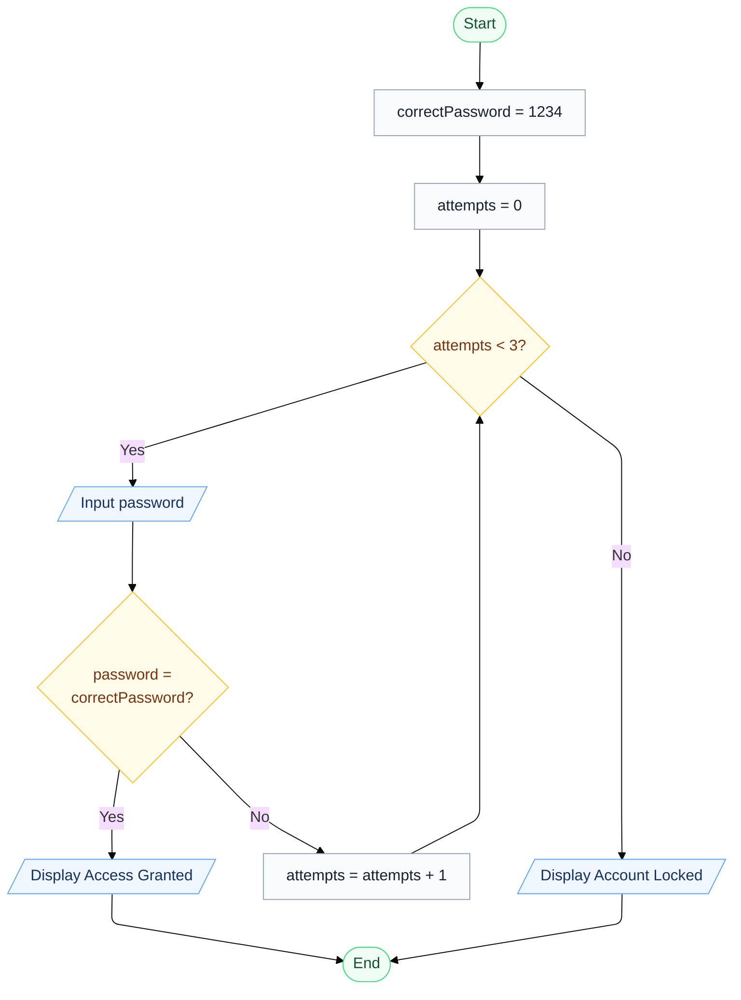

---

## 15. Store Checkout with Multiple Items

Write the algorithm and draw the flowchart for a program that inputs the number of items purchased, calculates the total purchase amount using a loop, and applies a **15% discount** if the total exceeds 5000 SEK.

### <span style="color: #22c55e;">✔</span> Pseudocode

```text
START
    INPUT numberOfItems
    total = 0

    FOR i = 1 TO numberOfItems
        INPUT price
        total = total + price
    ENDFOR

    IF total > 5000 THEN
        discount = total * 0.15
        total = total - discount
    ENDIF

    PRINT total
END
```

### <span style="color: #22c55e;">✔</span> Mermaid Flowchart

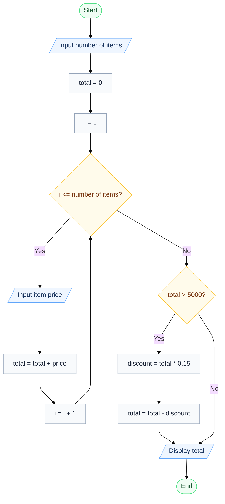

---

## 16. Electricity Bill Calculator

Write the algorithm and draw the flowchart for a program that inputs the number of electricity units consumed and calculates the total bill using the following rates:

- First 100 units: **1.5 SEK per unit**
- Next 200 units: **2.0 SEK per unit**
- Remaining units: **3.0 SEK per unit**

### <span style="color: #22c55e;">✔</span> Pseudocode

```text
START
    INPUT units

    IF units <= 100 THEN
        bill = units * 1.5

    ELSE IF units <= 300 THEN
        bill = 100 * 1.5
        bill = bill + (units - 100) * 2.0

    ELSE
        bill = 100 * 1.5
        bill = bill + 200 * 2.0
        bill = bill + (units - 300) * 3.0
    ENDIF

    PRINT bill
END
```

### <span style="color: #22c55e;">✔</span> Flowchart

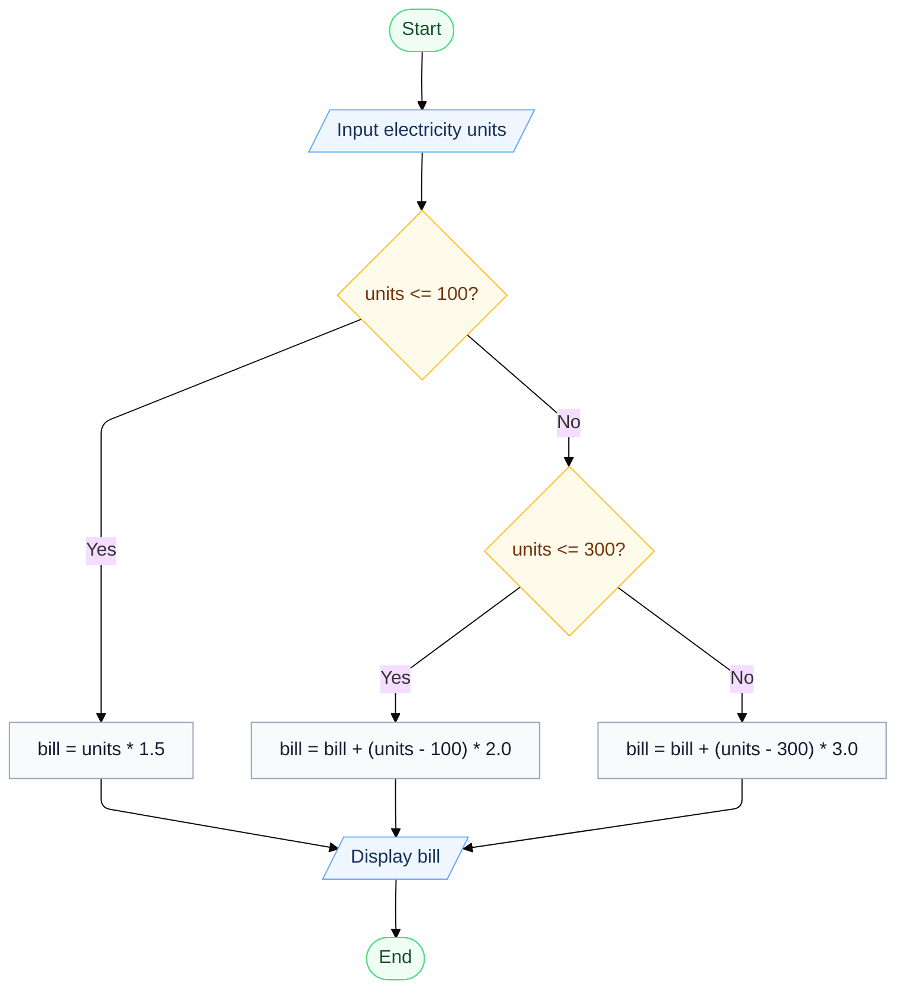

---